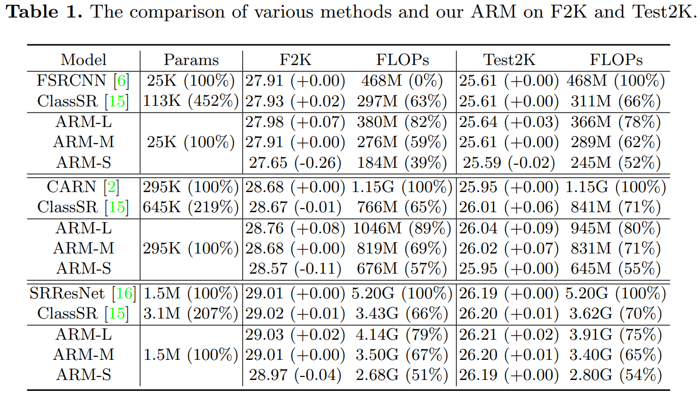
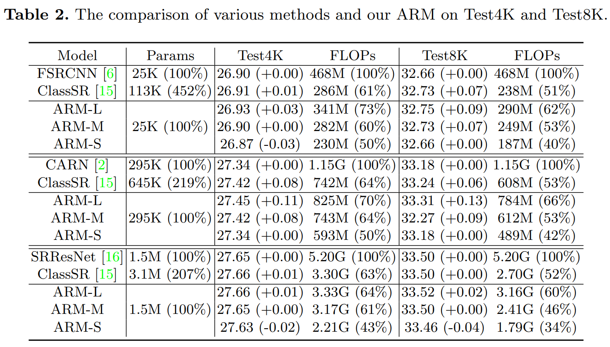

# ARM-Net

## Dependencies

* Python 3.6
* Pytorch 1.7

## Results






## Train

### Data preprocessing

```bash
cd data_scripts
python extract_subimages_test.py
python data_augmentation.py
python generate_mod_LR_bic.py
python extract_subimages_train.py
```

## Modify the configuration file (options/*.yml)

```bash
# train_us_fsrcnn.yml
is_train: True

# train_us_carn.yml
is_train: True

# train_us_srresnet.yml
is_train: True
```

### Run training scripts

```bash
python main.py -opt options/train_us_fsrcnn.yml
python main.py -opt options/train_us_carn.yml
python main.py -opt options/train_us_srresnet.yml
```

## Test

### Modify the configuration file (options/*.yml)

```bash
# train_us_fsrcnn.yml
path:
  pretrain_model_G: ckpt/arm-fsrcnn.pth
  resume_state: ckpt/arm-fsrcnn.state
is_train: False
is_test: True

# train_us_carn.yml
path:
  pretrain_model_G: ckpt/arm-carn.pth
  resume_state: ckpt/arm-carn.state
is_train: False
is_test: True

# train_us_srresnet.yml
path:
  pretrain_model_G: ckpt/arm-srresnet.pth
  resume_state: ckpt/arm-srresnet.state
is_train: False
is_test: True
```

### Run test scripts

```bash
python main.py -opt options/train_us_fsrcnn.yml
python main.py -opt options/train_us_carn.yml
python main.py -opt options/train_us_srresnet.yml
```

